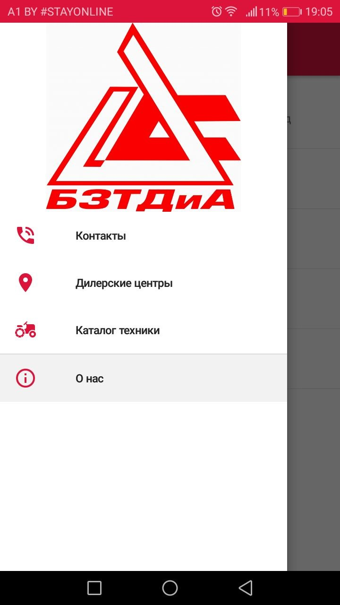
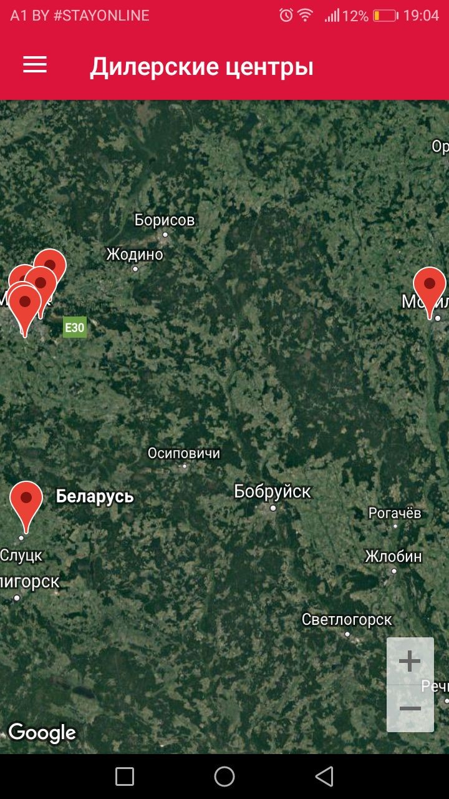
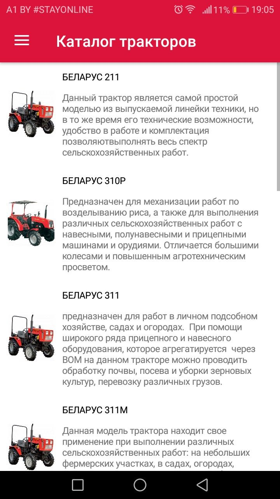
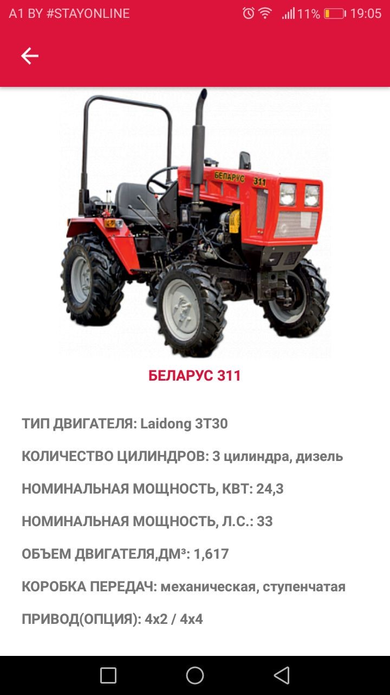

# MobileHelper
Ассистент для мобильных устройств с ОС Android, который предоставляет пользователю актуальную информацию о расположениях дилерских центров, производимой технике, контактных данных, разработанный на платформе Xamarin.

Функционал:
-	Совершение звонков по данным номерам в приложении, построение маршрута до дилерского центра в стороннем приложении карт, отправка писем по контактным данным;
-	Контактные данные и основную информацию о предприятии;
-	Карту с отображенными на ней дилерскими центрами и адресами;
-	Полный каталог техники с подробными характеристиками. 
 
 
 
 
 
 
 
 
